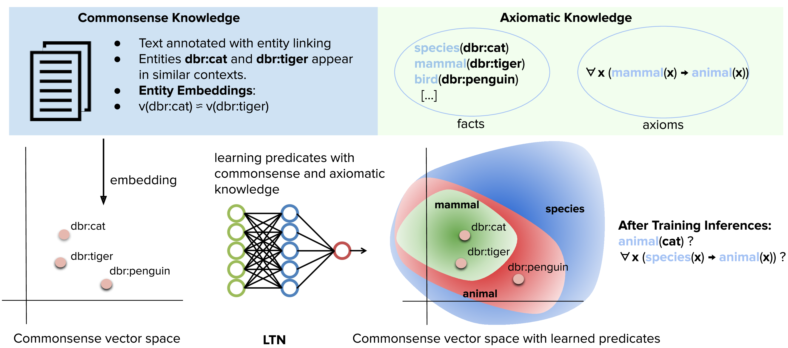

=============================================================
Complementing Logical Reasoning with Sub-Symbolic Commonsense
=============================================================

This repository contains the code for the following paper:

Bianchi, F., Palmonari, M., Hitzler, P., & Serafini, L. (2019).
**Complementing Logical Reasoning with Sub-Symbolic Commonsense**.
In International Joint Conference on Rules and Reasoning. `paper <https://link.springer.com/chapter/10.1007/978-3-030-31095-0_11>`_.

==========
How To Run
==========

* All the dataset are available in the `dataset` folder

* You can find everything in the jupyter notebook. Inside it you will be able to load all the datasets and test both the DNN and the Logic Tensor Network.

* For PSL you can use the code available on the `original repo <https://github.com/linqs/psl-examples>`_

* We used the original implementation of `LTNs <https://github.com/logictensornetworks/logictensornetworks>`_ 
